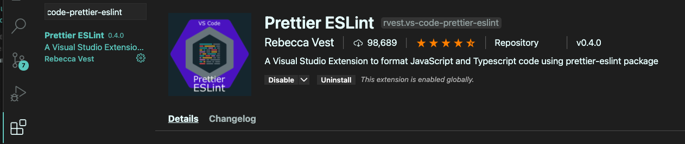
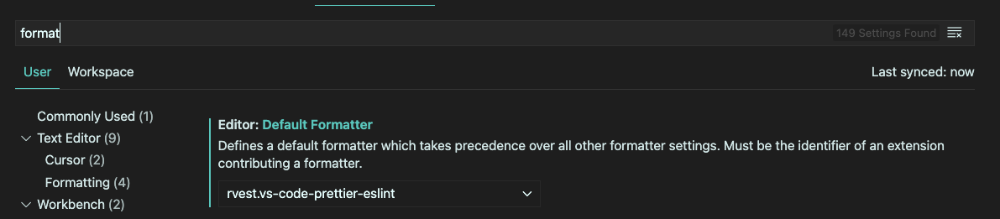

# eslint-config-rokket-labs


Official Rokket Labs ESLint configuration for all JS/TS projects. Includes Prettier configuration! :rocket:

## Usage

Use the following command to install this configuration

```
// With npx
npx install-peerdeps --dev eslint-config-rokket-labs -Y
```

Or if you want to use yarn/npm directly

```
// With yarn
yarn add -D eslint prettier prettier-eslint eslint-config-prettier eslint-plugin-import eslint-plugin-prettier eslint-plugin-simple-import-sort eslint-config-rokket-labs

// With npm
npm install --save-dev eslint prettier prettier-eslint eslint-config-prettier eslint-plugin-import eslint-plugin-prettier eslint-plugin-simple-import-sort eslint-config-rokket-labs
```

After installing, add `"extends": ["rokket-labs"]` to your `.eslintrc` file.

Then, create a new file called `prettier.config.js` on the root of your project, and add the following line:

```javascript
module.exports = require('eslint-config-rokket-labs/prettier')
```

### Use with VSCode

Search and install the following extension: `rvest.vs-code-prettier-eslint` and add it as a default formatter on VSCode settings (with `Editor: Default Formatter`).





Also, make sure `Editor: Format On Save` is enabled so you can take full advantage of our configuration.

### Use with Typescript

If you want to use this with Typescript, install the following packages:

```
yarn add -D @typescript-eslint/eslint-plugin @typescript-eslint/parser
```

Copy the following config to your `.eslintrc.json` file, changing the settings as you see fit:

```json
{
  "root": true,
  "env": {
    "node": true,
    "jest": true
  },
  "extends": [
    "rokket-labs", // Change to rokket-labs/react or rokket-labs/react-native if using on front end
    "plugin:@typescript-eslint/recommended",
    "plugin:security-node/recommended"
  ],
  "parser": "@typescript-eslint/parser",
  "parserOptions": { 
    "project": "./tsconfig.json",
    "sourceType": "module"
  },
  "plugins": ["@typescript-eslint"],
  "rules": {
    "no-use-before-define": "off",
    "@typescript-eslint/no-use-before-define": ["error"],
  },
  "settings": {
    "import/extensions": [".js", ".jsx", ".ts", ".tsx"],
    "import/parsers": {
      "@typescript-eslint/parser": [".ts", ".tsx"]
    },
    "import/resolver": {
      "node": {
        "extensions": [".js", ".jsx", ".ts", ".tsx"]
      }
    }
  }
}
```

### Use with React or React Native

By default, the `rokket-labs` ESLint configuration works with Node and plain JS projects.

If you want to use it for React projects, add `"extends": "rokket-labs/react"` or `"extends": "rokket-labs/react-native"` (for React Native projects) to your `.eslintrc.json` file.

## Contributing

To contribute to this configuration (we are accepting pull requests!), create an [issue](https://github.com/rokket-labs/eslint-config-rokket-labs/issues) and then link your PR to this issue.

To run this configuration locally, install all peer dependencies and then `yarn link` this project to test it out before uploading a pull request.
